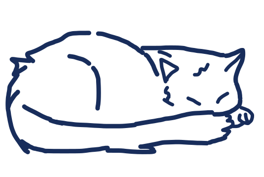
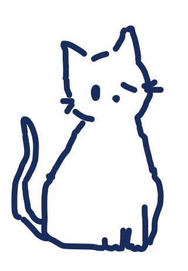
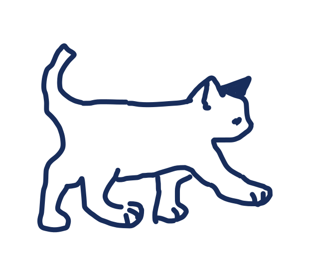
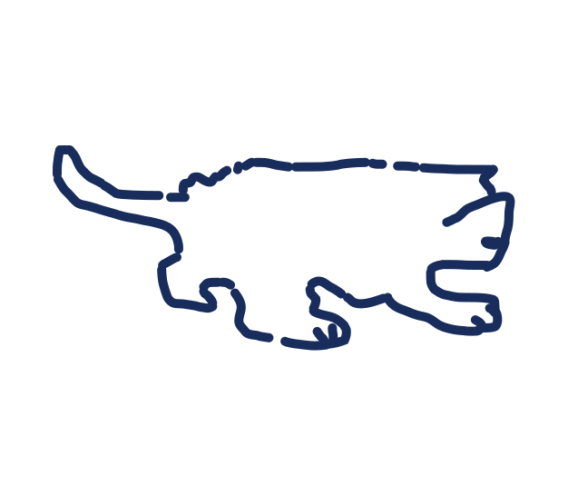

# Cat Feature Backup

Re-add these snippets if you want the homepage cat companion back later.

## HTML

Insert after the `#fishCursor` element in `index.html`:

```html
<button class="cat-companion is-sleeping" id="catCompanion" aria-label="wake the cat">
  <span class="cat-sleeping">
    
  </span>
  <span class="cat-sitting">
    
  </span>
  <span class="cat-walking cat-frame-a">
    
  </span>
  <span class="cat-walking cat-frame-b">
    
  </span>
</button>
```

## CSS

Restore this block in `styles.css`:

```css
.cat-companion {
  position: fixed;
  right: 1.2rem;
  bottom: 1rem;
  width: 174px;
  height: 114px;
  padding: 0;
  border: 0;
  background: transparent;
  color: #111;
  z-index: 110;
}

.cat-companion span {
  position: absolute;
  inset: 0;
}

.cat-companion img {
  width: 100%;
  height: 100%;
  display: block;
  background: transparent;
  object-fit: contain;
  object-position: center;
}

.cat-walking {
  opacity: 0;
  transform-origin: center center;
}

.cat-sitting {
  opacity: 0;
}

.cat-sitting img {
  transform: scale(0.74);
  transform-origin: center bottom;
}

.cat-companion.is-facing-left .cat-sitting img {
  transform: scale(0.74) scaleX(-1);
}

.cat-sleeping img {
  transform: scale(0.84);
  transform-origin: center bottom;
}

.cat-companion.is-awake .cat-sleeping,
.cat-companion.is-parked .cat-sleeping,
.cat-companion.is-parked .cat-walking {
  opacity: 0;
}

.cat-companion.is-awake .cat-walking {
  opacity: 1;
}

.cat-companion.is-parked .cat-sitting {
  opacity: 1;
}

.cat-companion.is-awake .cat-frame-a {
  opacity: 0;
}

.cat-companion.is-awake.is-step-b .cat-frame-a {
  opacity: 1;
}

.cat-companion.is-awake.is-step-b .cat-frame-b {
  opacity: 0;
}
```

## JavaScript

Restore these variables near the top of `script.js`:

```js
const catCompanion = document.getElementById("catCompanion");
const catWalkingFrames = catCompanion ? Array.from(catCompanion.querySelectorAll(".cat-walking")) : [];
```

Restore these state variables near the other `let` declarations:

```js
let catX = window.innerWidth - 180;
let catY = window.innerHeight - 140;
let catState = "sleeping";
let catFrameElapsed = 0;
let lastCatTime = 0;
let parkedDocX = 0;
let parkedDocY = 0;
```

Restore this behavior block near the hero reel setup:

```js
if (catCompanion) {
  catCompanion.addEventListener("click", () => {
    if (catState === "sleeping") {
      catState = "awake";
      catCompanion.classList.add("is-awake");
      catCompanion.classList.remove("is-sleeping", "is-parked");
      catCompanion.style.position = "fixed";
      catCompanion.style.right = "auto";
      catCompanion.style.bottom = "auto";
      return;
    }

    if (catState === "awake") {
      catState = "parked";
      parkedDocX = catX;
      parkedDocY = window.scrollY + catY;
      catCompanion.classList.remove("is-awake", "is-sleeping", "is-step-b");
      catCompanion.classList.add("is-parked");
      catCompanion.style.position = "absolute";
      catCompanion.style.left = `${parkedDocX}px`;
      catCompanion.style.top = `${parkedDocY}px`;
      catCompanion.style.right = "auto";
      catCompanion.style.bottom = "auto";
      return;
    }

    if (catState === "parked") {
      catState = "awake";
      catX = parkedDocX;
      catY = parkedDocY - window.scrollY;
      catCompanion.classList.add("is-awake");
      catCompanion.classList.remove("is-sleeping", "is-parked");
      catCompanion.style.position = "fixed";
      catCompanion.style.left = `${catX}px`;
      catCompanion.style.top = `${catY}px`;
      catCompanion.style.right = "auto";
      catCompanion.style.bottom = "auto";
      return;
    }

    if (catState !== "sleeping") {
      catState = "sleeping";
      catCompanion.classList.remove("is-step-b");
      catCompanion.classList.remove("is-awake", "is-parked", "is-facing-left");
      catCompanion.classList.add("is-sleeping");
      catCompanion.style.position = "fixed";
      catCompanion.style.left = "";
      catCompanion.style.top = "";
      catCompanion.style.right = "1.2rem";
      catCompanion.style.bottom = "1rem";
      catX = window.innerWidth - 180;
      catY = window.innerHeight - 140;
    }
  });
}

function animateCat(now) {
  const delta = lastCatTime ? now - lastCatTime : 16;
  lastCatTime = now;

  if (catState === "awake") {
    const restRadius = 150;
    const chaseStartRadius = 210;
    const dxToFish = mouseX - catX;
    const dyToFish = mouseY - catY;
    const distanceToFish = Math.hypot(dxToFish, dyToFish) || 0.001;
    const targetX = mouseX - (dxToFish / distanceToFish) * restRadius;
    const targetY = mouseY - (dyToFish / distanceToFish) * restRadius;
    const dx = targetX - catX;
    const dy = targetY - catY;
    const distance = Math.hypot(dx, dy);
    const moveSpeed = 1.45;
    const catFacingLeft = dx < -4;

    catCompanion.classList.toggle("is-facing-left", catFacingLeft);
    catWalkingFrames.forEach((frame) => {
      frame.style.transform = catFacingLeft ? "scaleX(-1)" : "";
    });

    if (distanceToFish > chaseStartRadius && distance > 0.001) {
      const step = Math.min(moveSpeed, distance);
      catX += (dx / distance) * step;
      catY += (dy / distance) * step;
    }

    catCompanion.style.position = "fixed";
    catCompanion.style.left = `${catX}px`;
    catCompanion.style.top = `${catY}px`;
    catCompanion.style.right = "auto";
    catCompanion.style.bottom = "auto";

    if (distanceToFish > chaseStartRadius && distance > 12) {
      catFrameElapsed += delta;

      if (catFrameElapsed >= 280) {
        catCompanion.classList.toggle("is-step-b");
        catFrameElapsed = 0;
      }
    } else {
      catFrameElapsed = 0;
      catCompanion.classList.remove("is-step-b");
    }
  } else if (catState === "parked") {
    catCompanion.style.position = "absolute";
    catCompanion.style.left = `${parkedDocX}px`;
    catCompanion.style.top = `${parkedDocY}px`;
  } else {
    catCompanion.classList.remove("is-step-b", "is-facing-left");
    catWalkingFrames.forEach((frame) => {
      frame.style.transform = "";
    });
  }

  requestAnimationFrame(animateCat);
}

if (catCompanion) {
  requestAnimationFrame(animateCat);
}
```
